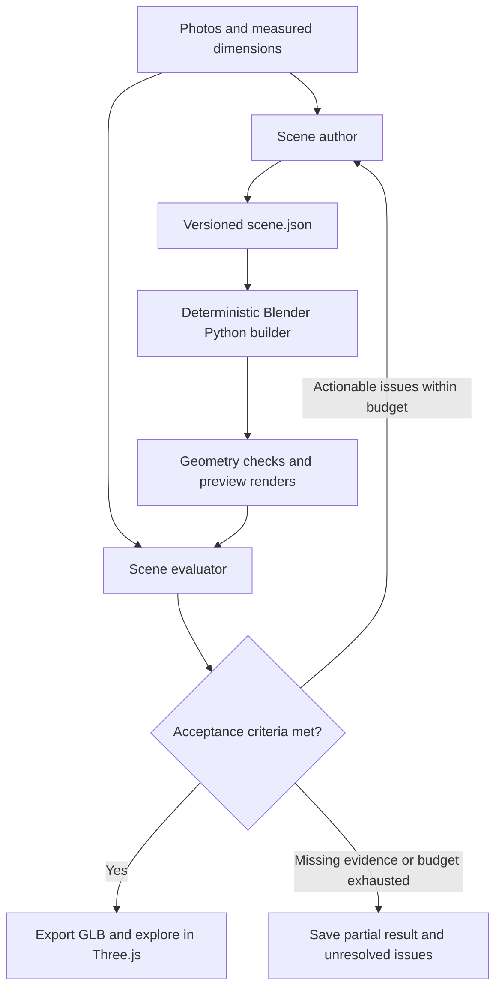

# 3D Studio Demo

Reconstruct an editable 3D space from photos, using an explicit scene description and an iterative evaluation loop.

The core experiment is whether a vision model can translate photographs into useful spatial data: objects, dimensions, relationships, materials, and uncertainty. A deterministic Blender Python builder should be able to reconstruct the space from that data without interpreting the photographs itself.

**Status:** configuration and planning only. No scene schema, Blender builder, model API integration, evaluator, or browser viewer has been implemented.

## Intended workflow

The scene description is the source of truth. Model-generated Blender code is possible, but our first experiment will separate spatial interpretation from geometry construction. Geometry or asset references must be sufficiently specific for the builder; descriptions such as “a nice chair” leave reconstruction decisions unresolved.

Codex subagents help us develop and exercise this workflow. Their configuration does **not** implement an autonomous application pipeline or start API jobs. A runtime orchestrator is a later milestone.

## Codex setup

- [AGENTS.md](AGENTS.md) defines project conventions, delegation, and reconstruction rules.
- [.codex/config.toml](.codex/config.toml) enables subagents and caps concurrent child threads at three, in addition to the main agent.
- [.codex/agents/scene_author.toml](.codex/agents/scene_author.toml) defines the spatial interpretation and revision role.
- [.codex/agents/blender_builder.toml](.codex/agents/blender_builder.toml) defines the deterministic construction role.
- [.codex/agents/scene_evaluator.toml](.codex/agents/scene_evaluator.toml) defines an independent evaluator that does not edit the candidate or acceptance criteria.

No model or reasoning overrides are set in this repo. Codex resolves them from the session and any user-level agent defaults. The project config does not change permission settings or enable shell network access.

Open a new Codex session in this repository to load the project setup. Project configuration loads only for a trusted project; use Codex's normal trust flow if prompted. Custom-role availability depends on the client. If a role is unavailable, the main agent can pass the corresponding role instructions to a standard subagent and report that fallback.

Examples for future sessions:

> Work on milestone 2 only. Use scene_author to propose the contract and scene_evaluator to critique whether it is sufficient and testable. Return the unresolved decisions before implementing the builder.

> Implement milestone 3 from the agreed scene contract. Delegate the builder to blender_builder and independently check its output before updating the checklist.

Configuration follows the official [subagent documentation](https://learn.chatgpt.com/docs/agent-configuration/subagents) and [configuration reference](https://learn.chatgpt.com/docs/config-file/config-reference), consulted on 2026-09-10. Installed CLI at setup: `codex-cli 0.153.4`.

## Step-by-step roadmap

Check a task only when its deliverable exists and its relevant checks pass. This roadmap records direction; it does not authorize running every milestone automatically.

### 0. Establish the workflow

- [x] Agree on explicit scene data, deterministic construction, and iterative evaluation.
- [x] Add project Codex configuration and specialized agent instructions.
- [x] Record the milestones and acceptance approach in this README.

### 1. Choose one reference room

- [ ] Select one room and collect several overlapping photos or walkthrough frames.
- [ ] Record available measurements and assign stable IDs to reference images.
- [ ] Identify unseen areas and reserve an independent reference view for the final check when coverage allows.
- [ ] Choose local storage for private references and generated artifacts; keep them out of git.

Done when the input set, known dimensions, and missing evidence are explicit.

### 2. Define the scene and evaluation contracts

- [ ] Define a versioned Pydantic/JSON Schema scene contract with stable object IDs.
- [ ] Specify meters, coordinate axes, origin, rotation convention, and transform semantics.
- [ ] Describe room boundaries, openings, objects, geometry or asset references, materials, and cameras/lights.
- [ ] Distinguish measured, inferred, and unknown values, with reference-image evidence.
- [ ] Define structured evaluation findings: object ID, issue, severity, evidence, suggested correction, and unresolved uncertainty.
- [ ] Define acceptance criteria and numerical tolerances before evaluating candidates.
- [ ] Create a small synthetic fixture that exercises the contract without an API call.

Done when a builder can construct the fixture without guessing missing semantics and an evaluator can identify concrete violations.

### 3. Build deterministically in Blender

- [ ] Set up Python dependencies and verify the local Blender executable/version.
- [ ] Implement scene validation and a minimal builder for walls, openings, and simple furniture.
- [ ] Reject unsupported geometry/assets with actionable errors.
- [ ] Produce a Blender scene, camera-matched previews, and a GLB export.
- [ ] Verify repeatability using the same input, asset versions, Blender version, and seeds; compare geometry/transforms rather than binary file identity.

Done when the synthetic fixture builds and exports successfully without a model call.

### 4. Interpret reference images

- [ ] Connect a vision-capable model to the scene contract through structured outputs.
- [ ] Generate a first room description with evidence and explicit uncertainties.
- [ ] Render the description through the existing builder without room-specific code changes.
- [ ] Record model/prompt versions, input IDs, and the scene revision for reproducibility.

Done when photographs produce a valid, inspectable first reconstruction; visual accuracy is evaluated separately.

### 5. Evaluate and revise

- [ ] Implement deterministic checks for measured dimensions, object transforms, invalid geometry, and relevant collisions/clearances.
- [ ] Compare source photos with matched-camera renders for layout, missing objects, proportions, and materials.
- [ ] Distinguish camera-alignment errors, scene-data errors, and builder defects before proposing fixes.
- [ ] Exercise one author/evaluator cycle with explicit scene revisions and structured findings.
- [ ] Implement a bounded orchestrator with saved candidates, evaluation history, and stopping outcomes.
- [ ] Check the selected candidate against the reserved reference view without using that view to tune it.

Done when a run can finish as `accepted`, `needs_evidence`, or `budget_exhausted`, retaining its best candidate and unresolved issues. A failed tool/API operation must be reported separately, never counted as acceptance.

### 6. Explore in the browser

- [ ] Build a minimal Three.js viewer that loads the exported GLB.
- [ ] Add orbit, zoom, and useful camera presets.
- [ ] Preserve object/group identity for cutaway and visibility controls.
- [ ] Verify the exported scene and basic interaction in a browser.
- [ ] Add walking controls only after the core viewing experience works.

Done when a saved reconstruction is navigable without a live model call.

### 7. Test generalization

- [ ] Reconstruct a second room using the same contract and builder.
- [ ] Record where new assets suffice and where the contract or builder needs extensions.
- [ ] Compare fidelity, correction count, runtime, and model cost using the same evaluation procedure.

Done when we can explain what generalizes, what fails, and what input coverage the workflow requires.

## Evaluation principles

Geometric correctness and visual resemblance are separate. Hard checks should use measured constraints and explicit tolerances. Visual findings must cite reference images and candidate views; a single aesthetic score cannot establish reconstruction accuracy.

Start the pilot with an initial candidate and at most three revision cycles. Set the API spending and rendering budgets before enabling an automated run. These are planned controls, not implemented enforcement. Stop early when missing observations prevent a defensible correction, and retain the best candidate if a revision regresses.

Passing means satisfying the declared checks within observed coverage. It does not establish the geometry of unseen areas. Keep unknowns visible instead of converting plausible guesses into measurements.

## Inspiration

- [Original X post](https://x.com/rpnickson/status/2097488440489116111)
- [Studio in Bricks](https://studio-in-bricks.rpn24.chatgpt.site/)
- [Studio interior demo](https://studio-in-bricks.rpn24.chatgpt.site/interior)
- [Architectural visualization with Astra](https://developers.openai.com/blog/architectural-visualization-with-astra)

Inspection confirmed that the interior demo loads a Blender-exported GLB through Three.js. Its original prompts and any intermediate scene schema remain unverified. Reference implementations and assets are not copied into this project.
